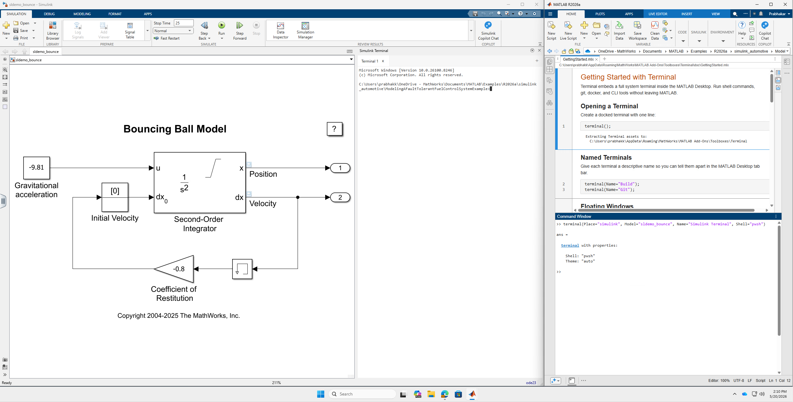

# Terminal in MATLAB

[](https://matlab.mathworks.com/open/github/v1?repo=matlab/terminal-in-matlab&file=toolbox/doc/Install.m) &nbsp; [](../../releases/latest/download/Terminal.mltbx) &nbsp; 


Run a terminal in MATLAB®. Use the terminal to run command-line interface tools such AI coding agents, `git`, and `docker` without leaving the MATLAB desktop.


## Table of Contents

- [Get Started](#get-started)
- [Use Terminal in Simulink](#use-terminal-in-simulink)
- [Additional Terminal Commands](#additional-terminal-commands)
- [Uninstall](#uninstall)
- [Set Up AI Agents](#set-up-ai-agents) *(deprecated)*
- [Licensing](#licensing)
- [Contact Support](#contact-support)

## Get Started

- You require MATLAB R2024b or later.
- Download [MATLAB Terminal (GitHub)](../../releases/latest/download/Terminal.mltbx) and install the toolbox in MATLAB:
  ```matlab
  url = 'https://github.com/matlab/terminal-in-matlab/releases/latest/download/Terminal.mltbx';
  tbx = 'Terminal.mltbx';

  websave(tbx, url);
  installed = mpminstall(tbx)
  ```
- Open a terminal in MATLAB:
  ```matlab
  % Open a docked terminal
  t = terminal();
  ```

## Use Terminal in Simulink

Dock a terminal directly into the Simulink® editor as a right-side panel. This gives you command-line access alongside your model without switching windows.



```matlab
% Dock terminal in the most recently active Simulink editor
t = terminal(Place="simulink");

% Target a specific model by name
t = terminal(Model="myController");

% Customize the panel title
t = terminal(Place="simulink", Name="Build");
```

Requirements:
- Simulink must be installed and a model must be open before running the command.
- The terminal panel appears in the right dock of the Simulink editor.

## Additional Terminal Commands

You can use these additional commands with your terminal.

| Description                    | Command                                                                                           |
| ------------------------------ | ------------------------------------------------------------------------------------------------- |
| Copy                           | `Ctrl` + `Shift` + `C`                                                                            |
| Paste                          | `Ctrl` + `Shift` + `V`                                                                            |
| Update terminal                | terminal.update()                                                                                 |
| Uninstall terminal             | matlab.addons.uninstall('Terminal')                                                               |
| Open with a custom title       | `t = terminal(Name="Build");`                                                                     |
| Open in a floating window      | `t = terminal(WindowStyle="normal");`                                                             |
| Open with a specific shell     | Linux/macOS: `t = terminal(Shell="zsh");`<br><br>Windows: `t = terminal(Shell="powershell.exe");` |
| Dock in Simulink editor        | `t = terminal(Place="simulink");`                                                                 |
| Dock in a specific model       | `t = terminal(Model="myModel");`                                                                  |
| Query where terminal is docked | `t.Place`                                                                                         |
| Customize terminal color theme | For instructions, see [Customize Terminal Theme (GitHub)](/docs/customize-terminal-theme.md)      |
| List all running terminals     | `terminal.list()`                                                                                 |
| Close all running terminals    | `terminal.closeAll()`                                                                             |
| Close a single terminal        | `delete(t);` or `exit`                                                                            |
| Query the shell in use         | `t.Shell`                                                                                         |
| Check the installed version    | `terminal.version()`                                                                              |

## Uninstall

To remove Terminal and all artifacts it created:

```matlab
% 1. Uninstall the toolbox
mpmuninstall('Terminal')

% 2. Remove saved preferences
if ispref('terminal'), rmpref('terminal'); end

% 3. Remove downloaded agentic toolkits (if you used Agentic=true)
if ispc, home = getenv('USERPROFILE'); else, home = getenv('HOME'); end
rmdir(fullfile(home, '.matlab', 'agentic-toolkits'), 's')
```

### Set Up AI Agents

> [!WARNING]
> The following APIs are deprecated and will be removed in a future release. They will be replaced by a dedicated agentic installer for MathWorks products.


To use AI agents in the MATLAB terminal, you can use a wizard which sets up for you:

- an AI agent such as Claude Code, GitHub Copilot, OpenAI Codex, Gemini, or Amp.
- the [MATLAB MCP Server](https://github.com/matlab/matlab-mcp-server)
- skills to help your AI agent use MATLAB and Simulink, from [MATLAB Agentic Toolkit (GitHub)](https://github.com/matlab/matlab-agentic-toolkit) and [Simulink Agentic Toolkit (GitHub)](https://github.com/matlab/simulink-agentic-toolkit)

Run the wizard:

```matlab
% Interactive wizard (first run)
t = terminal(Agentic=true);
```

You can also programmatically specify your agent and toolkits.

```
t = terminal(Agent="claude");
t = terminal(Agent="copilot");
t = terminal(Agent="codex");
t = terminal(Agent="gemini", Toolkits=["matlab","simulink"]);
```

To change your options later on, run `terminal.resetAgentOptions` and re-run interactive wizard.

For more information about using the AI setup process, see [Using the Terminal AI Setup (GitHub)](/docs/terminal-ai-setup.md).

### Upgrading from v0.2.0 to v0.3.0

> [!IMPORTANT]
> The `matlab-mcp-core-server` binary has been replaced by `matlab-mcp-server` from [matlab/matlab-mcp-server](https://github.com/matlab/matlab-mcp-server). If you used `terminal(Agentic=true)` with v0.2.0, re-register your AI agent so its configuration points to the new binary:
>
> ```matlab
> terminal.resetAgentOptions()
> terminal(Agentic=true)
> ```
>
> This downloads the new MCP server binary and rewrites your agent's configuration files (e.g., `.claude.json`, Copilot settings, Codex config) with the updated path.


## Licensing

The license is available in the [LICENSE.md](LICENSE.md) file in this GitHub repository.

## Contact Support

MathWorks encourages you to use this repository and provide feedback. To request technical support or submit an enhancement request, [create a GitHub issue](https://github.com/matlab/terminal-in-matlab/issues) or contact [MathWorks Technical Support](https://www.mathworks.com/support/contact_us.html).

---

Copyright 2026 The MathWorks, Inc.

---
